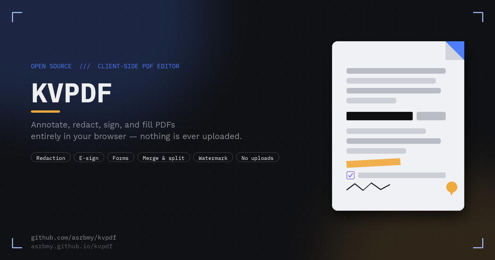

<div align="center">


# KVPDF

**A free, open-source PDF editor that runs entirely in your browser.**
No uploads. No server. No account. Your files never leave your device.

**🔗 Live app: [asrbmy.github.io/kvpdf](https://asrbmy.github.io/kvpdf)**

[](https://asrbmy.github.io/kvpdf)
[](#license)
[](#how-it-works)



</div>

---

## What is KVPDF?

KVPDF is a full-featured PDF editor that runs as a single static web page. There's nothing to install and nothing to sign up for — open the page, drop in a PDF, and start editing. Because every operation happens locally in your browser using WebAssembly-backed JavaScript libraries, **your documents are never transmitted anywhere**. That makes it a reasonable choice for contracts, forms, and anything else you'd rather not hand to a third-party server.

It's aimed at the everyday PDF tasks people usually reach for a paid tool (or an untrustworthy free website) to do: marking up a document, blacking out sensitive information, signing something, filling out a form, or tidying up a multi-file merge — without the upload step.

## Try it now

👉 **[asrbmy.github.io/kvpdf](https://asrbmy.github.io/kvpdf)**

No install, no login. Works on desktop and mobile browsers.

## Features

### Annotate & mark up
- Freehand highlighter and pen
- Real text search with select-to-highlight (highlights the actual selected glyphs, not a freehand box)
- Text boxes and sticky-note comments
- Shapes: rectangle, ellipse, line, arrow

### Redact — properly
- Draw a box to black out sensitive content. Unlike tools that just draw an opaque rectangle on top of live text, KVPDF **flattens the redacted page to a high-resolution image on export**, so the underlying text is actually destroyed, not just hidden.

### Sign & insert media
- Draw a signature on a pad and stamp it anywhere, sized and positioned by drag
- Insert any image (logo, photo, scan) with drag-to-move and a resize handle

### Forms
- Auto-detects and fills existing AcroForm fields (text, checkbox, dropdown) on any PDF
- Or draw your **own** fillable text fields / checkboxes on a plain document, turning any PDF into a form — with a required-field toggle that blocks export until filled

### Page tools
- Reorder, rotate, and delete pages
- Merge in pages from another PDF
- Insert blank pages
- Multi-select pages for bulk rotate / delete / **extract as a new PDF**

### Finishing touches
- Watermarking (text, color, opacity, applied across the document)
- Page-number stamping (position + starting number)
- Normalize every page to A4 or US Letter on export
- Export quality toggle — standard (crisp) vs. compressed (smaller file)

### Quality of life
- Undo/redo and keyboard shortcuts for every tool
- Per-tool color memory
- Keyboard page navigation (Page Up/Down, Home/End, jump-to-page)
- **Autosaved sessions** — refresh the tab and pick up where you left off

## How it works

KVPDF is a single static `index.html` file with no build step and no backend. It's built on two well-established open-source libraries, loaded from a CDN:

| Library | Role |
|---|---|
| [**pdf.js**](https://mozilla.github.io/pdf.js/) (Mozilla) | Renders pages to canvas, extracts the text layer for search and selection, and reads existing form field definitions |
| [**pdf-lib**](https://pdf-lib.js.org/) | Reconstructs the final PDF on export — copying/embedding pages, flattening annotation overlays, creating real fillable form fields, and writing page metadata |

Annotations are composited onto a transparent canvas layer that sits above the (still-vector, still-searchable) original page. On export, that layer is rasterized and embedded back into the page at high resolution — so a highlighted, signed, or commented PDF still has selectable text everywhere except where you explicitly redacted or rotated it (those pages are intentionally flattened; see [Limitations](#known-limitations)).

Session state (page order, annotations, form values, and the source PDF bytes) is persisted using the browser's storage APIs so a refresh doesn't lose your work — nothing is written anywhere outside your own browser.

## Running locally

No dependencies, no build step — it's one HTML file.

```bash
git clone https://github.com/asrbmy/kvpdf.git
cd kvpdf
python3 -m http.server 8000
# open http://localhost:8000
```

Or just open `index.html` directly in a browser.

## Deploying your own copy

1. Push the repo contents (`index.html`, `assets/`, `site.webmanifest`, `robots.txt`, `sitemap.xml`) to the root of your default branch.
2. In **Settings → Pages**, set the source to that branch.
3. GitHub will publish it at `https://<your-username>.github.io/<repo-name>`.

## Project structure

```
kvpdf/
├── index.html          # the entire application (HTML + CSS + JS, no build step)
├── site.webmanifest     # PWA metadata (installable icon, theme color)
├── robots.txt
├── sitemap.xml
└── assets/
    ├── favicon.ico
    ├── icon-*.png        # favicon / PWA / apple-touch-icon set
    └── og-banner.png     # social share preview image
```

## Known limitations

- **No password protection.** The pdf-lib engine this runs on doesn't support PDF encryption, and there's no trustworthy client-side alternative to fake it with. For a password-protected copy, use `qpdf` or your OS's "Print to PDF" with a password.
- **Rotated and redacted pages are flattened to an image on export.** This is required for redaction to actually remove the underlying text, and for rotation to render correctly in every case — but it means those specific pages lose selectable/searchable text in the output PDF. Unrotated, non-redacted pages stay fully vector.
- **Very large PDFs** may exceed the per-session autosave storage limit. If that happens, KVPDF disables autosave for that session and tells you, rather than failing silently.

## Contributing

Issues and pull requests are welcome. Since this is a single-file app, most changes are straightforward to review — please keep new features consistent with the existing dark/mono-accent visual language and the "nothing leaves the browser" principle.

## License

MIT — see [`LICENSE`](LICENSE).

---

<div align="center">

Built with [pdf.js](https://mozilla.github.io/pdf.js/) and [pdf-lib](https://pdf-lib.js.org/).

[Live demo](https://asrbmy.github.io/kvpdf) · [Report an issue](https://github.com/asrbmy/kvpdf/issues)

</div>
